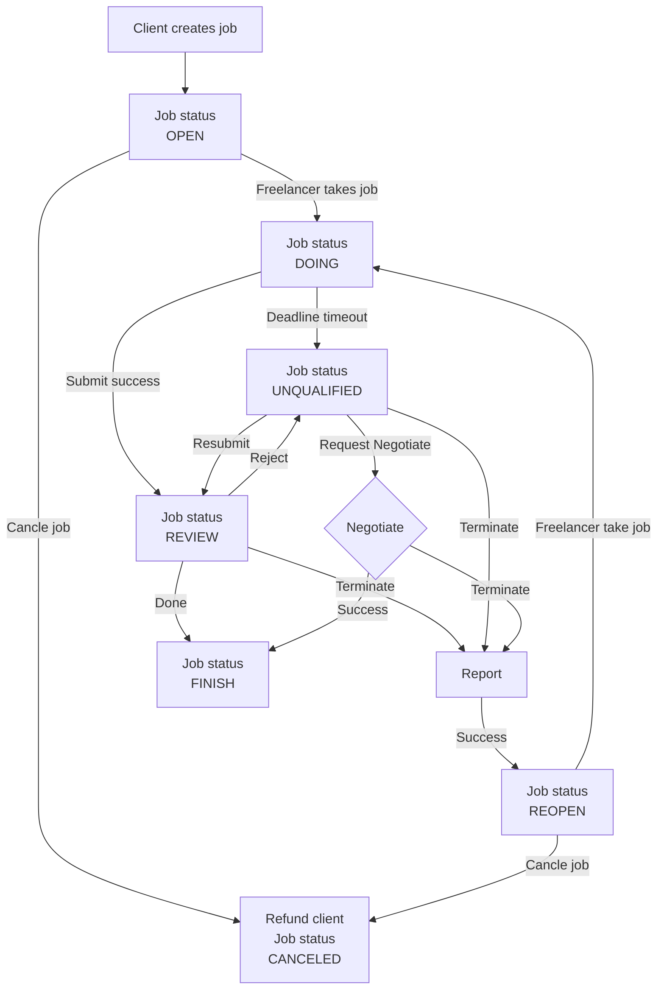

# Polkalance

Polkalance is a decentralized job marketplace built on Substrate and ink!. The platform allows users to post and find jobs securely and transparently.

## Features

* **Post and find jobs:** Users can post jobs or find jobs by position, skills, salary, etc.
* **Direct payment:** Workers will receive their salary directly to their Substrate wallet.
* **Transparency:** All transactions are recorded on the blockchain, ensuring transparency and immutability.

## How to use

To use Polkalance, you need a Substrate wallet. Once you have a wallet, you can visit the Polkalance website and log in with your wallet.

To post a job, you need to provide the following information:

* Job name
* Job description
* Salary
* Duration
* Category

To find a job, you can use filters to find jobs that match your needs.

## Architecture of smart contract

```mermaid

classDiagram
    class Account {
        - jobs: Mapping<JobId, Job>
        - current_job_id: JobId
        - personal_account_info: Mapping<AccountId, UserInfo>
        - owner_jobs: Mapping<AccountId, Vec<(JobId, bool)>>
        - freelancer_jobs: Mapping<AccountId, Vec<(JobId, bool)>>
        - ratings: Mapping<AccountId, Vec<(JobId, Option<RatingPoint>)>>
        - reports: Mapping<AccountId, Vec<(JobId, Option<ReportInfo>)>>
    }
    
    class Job {
        - name: String
        - job_id: JobId
        - description: String
        - category: Category
        - result: Option<String>
        - status: Status
        - budget: Balance
        - fee_percentage: u8
        - start_time: Timestamp
        - end_time: Timestamp
        - person_create: Option<AccountId>
        - person_obtain: Option<AccountId>
        - pay: Balance
        - feedback: String
        - request_negotiation: bool
        - requester: Option<AccountId>
        - reporter: Option<AccountId>
        - require_rating: (bool, bool)
        - unqualifier: bool
    }
    
    class Category {
        + NONE
        + IT
        + MARKETING
        + PHOTOSHOP
    }
    
    class RatingPoint {
        + OneStar
        + TwoStars
        + ThreeStars
        + FourStars
        + FiveStars
    }
    
    class Status {
        + OPEN
        + DOING
        + REVIEW
        + UNQUALIFIED
        + REOPEN
        + FINISH
        + CANCELED
    }
    
    class AccountRole {
        + INDIVIDUAL
        + ENTERPRISE
        + FREELANCER
    }
    
    class OnwerRoleInEnterprise {
        + TEAMLEAD
        + ACCOUNTANT
    }
    
    class UserInfo {
        - name: String
        - detail: String
        - role: AccountRole
        - successful_jobs_and_all_jobs: (u32, u32)
        - rating_points: i32
    }
    
    class JobError {
        + Registered
        + NotRegistered
        + NotJobAssigner
        + NotFreelancer
        + NotExisted
        + NotTaked
        + Taked
        + NotTakeThisJob
        + NotAssignThisJob
        + OutOfDate
        + Submited
        + Proccessing
        + CurrentJobIncomplete
        + Finish
        + InvalidPayAmount
        + InvalidNegotiation
        + InvalidTermination
        + InvalidReport
        + InvalidRating
    }
    
    Account --> JobId
    Account --> Job
    Account --> AccountId
    Account --> UserInfo
    Account --> Category
    Account --> RatingPoint
    Account --> ReportInfo
    Job --> JobId
    Job --> Category
    Job --> Status
    Job --> Balance
    Job --> Timestamp
    Job --> AccountId
    Job --> RatingPoint
    Job --> ReportInfo
    Category --> String
    RatingPoint --> String
    Status --> String
    AccountRole --> OnwerRoleInEnterprise
    UserInfo --> String
    UserInfo --> AccountRole
    JobError --> String

```

## How it works



## Download

Polkalance is currently in development. You can download the source code from [GitHub](https://github.com/lamha/polkalance).

## Documentation

<!-- Polkalance documentation is available on [GitHub](https://github.com//polkalance/tree/main/docs). -->

## Join the community

<!-- You can join the Polkalance community on [Discord](https://discord.gg/) or [Twitter](https://twitter.com/). -->

## Thank you

Thank you for your interest in Polkalance!
